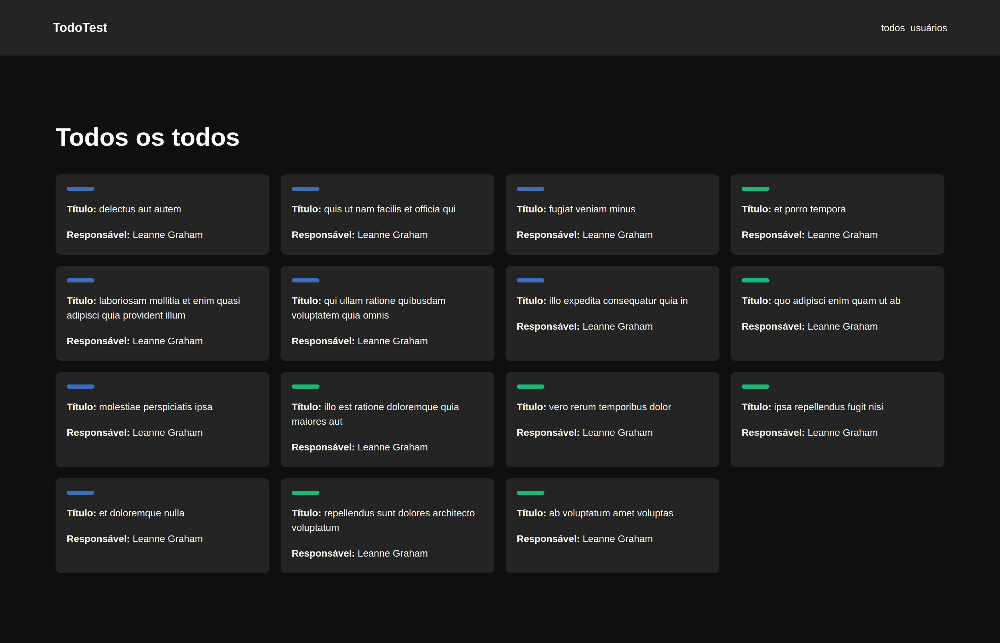

# TodoTest

Desafio de código - processo seletivo EWZ - Mundo Invest  
Você pode acessar em [TodoTest - Cipriano](https://cipriano-challenge-ewz.vercel.app/)

## Tecnologias utilizadas

- [NextJS](https://nextjs.org/)
- [TypeScript](https://www.typescriptlang.org/)
- [Chakra UI](https://chakra-ui.com/)
- [Axios](https://axios-http.com/)
- [{JSON} Placeholder](https://jsonplaceholder.typicode.com/)

## Funcionalidades

### Página Todos _/todos_

- Lista os 15 primeiros os Todos do end-point **/todos** da _free fake api_ [{JSON} Placeholder](https://jsonplaceholder.typicode.com/)
- Apresenta um indicativo visual com a cor azul caso a atividade ainda não foi finalizada e a cor verde caso a atividade já foi concluida.
- Exibe título da atividade e seus respectivos responsáveis.

### Página Usuários _/usuarios_

- Lista todos os usuários cadastrados do end-point **/users** da _free fake api_ [{JSON} Placeholder](https://jsonplaceholder.typicode.com/)
- Exibe informações básicas como: nome, email, telefone, website, rua e cidade.
